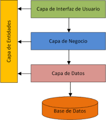

# JAVA CON JDBC Y PATRONES DAO / DTO / SINGLETON /MVC


Este proyecto es la version 3 de los 2 anteriores , en el cual ahora implemento el patron DTO Y MODELO VISTA CONTROLADOR (MVC)


## Estructura del proeycto 

```bash
JDBC_pstmt_with_DAO_dto_v3/
└── mainV3

config/
└── ConnectionJDBC

Capa_Datos/
└── User

Capa_Negocio/

Capa_Persistencia/
├── GenericDAO.java
├── UserDAO.java
└── UserImpl.java

Capa_Presentacion/
└── UserController.java


```


## DTO

- Los DTOs (Data Transfer Objects) son objetos utilizados para transferir datos entre las capas de la
  aplicación. Sirven como una representación de los datos que se intercambian entre las capas, evitando la
  exposición directa de las entidades de datos. Los DTOs suelen ser simples y contener solo los datos
  necesarios para la comunicación entre capa

- Las clases de entidad representan los objetos de dominio de la aplicación, es decir, los objetos que
  representan conceptos del mundo real con los que se trabaja en el sistema. Estas clases contienen la
  estructura y el comportamiento asociados con los datos de la aplicación.
  En resumen, en la arquitectura en capas, el patrón DAO se sitúa en la capa de acceso a datos y se utiliza
  para separar la lógica de acceso a datos del resto de la aplicación. Los DTOs se utilizan para transferir
  datos entre las capas y las clases de entidad representan los objetos de dominio de la aplicación. Juntos,
  estos componentes contribuyen a la modularidad y organización de la aplicación, facilitando su
  mantenimiento y escalabilidad.
  ¿Cómo implementamos el pat


## Creacion de aplicaciones en java

En la creación de aplicaciones Java, generalmente se organiza el código en varias capas para separar las responsabilidades y facilitar el mantenimiento, la escalabilidad y la reutilización del código. Estas capas son:


 

#### Capa de Presentación (Presentation Layer):

- Responsabilidad: Interactuar con el usuario final y mostrar los datos de la aplicación.
- Contiene: Interfaces de usuario (UIs) como páginas web (utilizando frameworks como JSP, Servlets, JSF), 
  aplicaciones de escritorio (Swing, JavaFX), y controladores (Controllers) que manejan la lógica de la 
  interfaz de usuario.
- En una API REST, los controladores (controllers) manejan las solicitudes HTTP, 
  gestionan las rutas y delegan el procesamiento a los servicios adecuados. 
 
  Ejemplo de un controller en una API REST utilizando Spring boot MVC
 

```javascript
  @RestController
@RequestMapping("/api/users")
public class UserController {

    @Autowired
    private UserService userService;

    @GetMapping
    public ResponseEntity<List<User>> getAllUsers() {
        List<User> users = userService.getAllUsers();
        return ResponseEntity.ok(users);
    }

    @GetMapping("/{id}")
    public ResponseEntity<User> getUserById(@PathVariable("id") Long id) {
        User user = userService.getUserById(id);
        if (user != null) {
            return ResponseEntity.ok(user);
        } else {
            return ResponseEntity.notFound().build();
        }
    }

    @PostMapping
    public ResponseEntity<User> createUser(@RequestBody User user) {
        User createdUser = userService.createUser(user);
        return ResponseEntity.status(HttpStatus.CREATED).body(createdUser);
    }

    @PutMapping("/{id}")
    public ResponseEntity<User> updateUser(@PathVariable("id") Long id, @RequestBody User user) {
        User updatedUser = userService.updateUser(id, user);
        if (updatedUser != null) {
            return ResponseEntity.ok(updatedUser);
        } else {
            return ResponseEntity.notFound().build();
        }
    }

    @DeleteMapping("/{id}")
    public ResponseEntity<Void> deleteUser(@PathVariable("id") Long id) {
        boolean deleted = userService.deleteUser(id);
        if (deleted) {
            return ResponseEntity.noContent().build();
        } else {
            return ResponseEntity.notFound().build();
        }
    }
}

```
  
  
#### Capa de Negocio o Servicios (Business Layer):

- Responsabilidad: Implementar la lógica de negocio de la aplicación, es decir, las reglas y operaciones 
   que definen el comportamiento de la aplicación.
- Contiene: Servicios (Services), gestores (Managers) y lógica de negocio pura. 
  También puede incluir validaciones y procesos de negocio.
- En mi caso estan con los controladores son los servicios private que instancian la clase UserImpl DAO 
  para guardar los datos en la capa de persistencia 
  
#### Capa de Persistencia (Persistence/Data Access Layer):

- Responsabilidad: Interactuar con la base de datos y manejar la persistencia de datos.
- Contiene: Objetos de Acceso a Datos (DAOs), repositorios (Repositories) y configuraciones de ORM 
- (como Hibernate). Esta capa se encarga de las operaciones CRUD (Crear, Leer, Actualizar, Eliminar) 
- sobre la base de datos.
- En mi caso tengo el 

#### Capa de Datos (Data Layer):

- Responsabilidad: Definir la estructura de los datos y las entidades de la aplicación.
- Contiene: Clases de modelo (Models/Entities) que representan las tablas de la base de datos en la 
  forma de objetos Java. Estas clases contienen los atributos y métodos relacionados con los datos.

